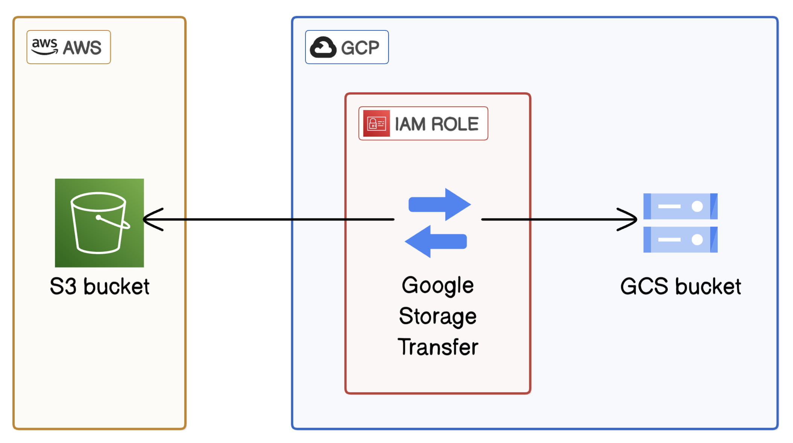

# Multi-Cloud-Data-Transfer

---

### Introduction

This repository demonstrates how to configure and execute **multi-cloud data transfers** between **Amazon Web Services (AWS)** and **Google Cloud Platform (GCP)**. The project uses **AWS S3**, **Google Cloud Storage**, and **GCP’s Storage Transfer Service** to automate secure cross-cloud data movement.

The project was completed to showcase practical expertise in **multi-cloud infrastructure, cross-platform authentication, and data transfer automation**. Documentation includes architecture diagrams and screenshots that illustrate each stage of the process, ensuring clarity and real-world applicability.

---

### Project Scope

This project focuses on building a data transfer pipeline that:

- Provisions an **AWS S3 bucket** with secure data.  
- Creates a **Google Cloud Storage bucket** as the transfer destination.  
- Configures **IAM roles and trust policies** for secure cross-cloud access.  
- Executes a **Storage Transfer Service job** to move files from S3 to GCP.  
- Demonstrates the use of **manifest files** for selective file transfers.  

---

### Technologies & Services Used

**Cloud Platforms:** AWS (S3, IAM), Google Cloud (Storage, Storage Transfer Service)  
**Tools:** Manifest files, IAM trust policies, Cloud Console, AWS CLI  
**Concepts:** Multi-cloud integration, identity federation, automated data transfer, selective file migration  

---

### Learning Objectives

- Understand how to connect AWS and GCP securely using IAM trust policies.  
- Create and configure **Storage Transfer Service jobs** in GCP.  
- Perform both **full** and **selective** (manifest-based) data transfers.  
- Gain insights into **multi-cloud redundancy, vendor-agnostic workflows,** and **cost optimization strategies**.  

---

### How to Explore

This repository contains:  
- A **detailed README.md** explaining setup, IAM configuration, and transfer steps.  
- Architecture diagrams that illustrate the data flow between AWS and GCP.  
- Example **manifest files** for selective transfers.  

---

### Project Architecture

This diagram provides a high-level overview of the multi-cloud transfer process, showing how files move securely between AWS and GCP using the Storage Transfer Service.

---

---
